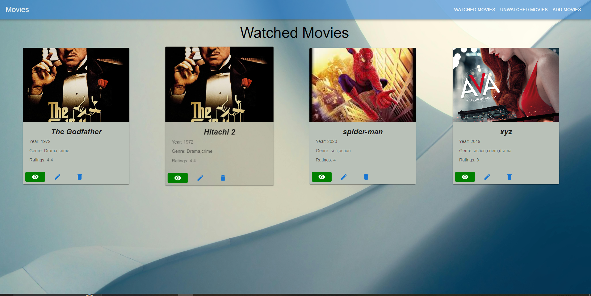
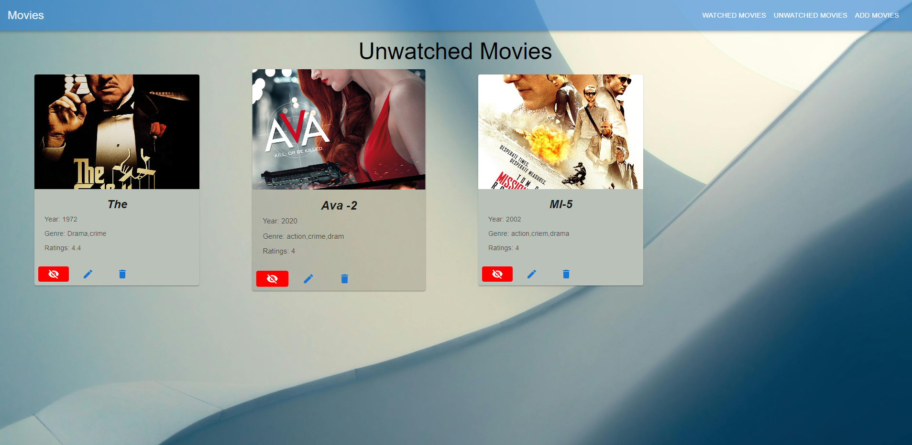
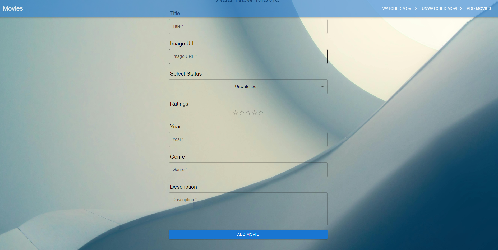

***** Movie list App *****

Basically it's a Movie List App app where user can See the list of Movies, and you can also add movie in movie list, i added have added some functions like Add, Edit, and Delete tow work all function i have created backend server using node.js, express.js and mongoDb. in this app i implemented all crude operation. for backend i use Node.js , and for  database i use mongoDb and for css material ui.

## Deployed Link

Assignment link :- [here](https://movie-watchlist-itn2.vercel.app/).

## Directory Structure
MOVIE-WatchLIST-/
|frontend
  ├─ public/
  ├─ src/
  │ ├─components
    ├─pages
    ├─Redux
    ├─Router
    ├─app.js
├─Backend
  ├─connections
  ├─Models
  ├─Routes
  ├─index.js

## video of project
Project video link [here]()

## Features
All crude Operations
- Get Data
- Add Data
- Update Data
- Delete Data
- ConfirmationPrompt for delete movie
- Snackbar after any operation completed
- Loading
- backed build by using Node.js and Added all crude operation in backend
- Website is Responsive

## Usage

To use Todo App locally->

1. Download the files from this repository.
2. Install dependencies by running `npm install` in your terminal.
3. Start the application using `npm start`.

## Screenshots

Screen Shots
Home Page

1. Watched Movies list

2. unWatched Movies List

3. Add Movies Form

4. Watched movie status showed in green and Unwatched Movie status showed in red color

5. Other functions are showed in video

## Tech Stack
- ReactJs
- Redux
- Node ja and MongoDb(for backend)
- Material ui(for css).